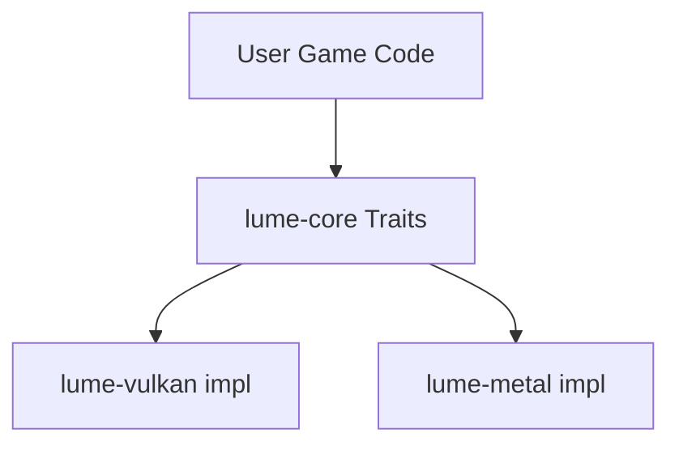

# Technical Design: Backend Abstraction

## The Trait System
LumeVisual uses a trait-based abstraction to ensure maximum performance. 

### Instance & Device
The `Instance` is the entry point. It creates a `Surface` (window connection) and then requests a `Device`.
The `Device` is the primary interface for resource creation.

### Swapchain & Presentation
The `Swapchain` is slightly backend-specific in implementation but exposes a common interface for:
- Acquiring the next image index.
- Presenting the rendered image.

### Commands & Synchronization
The `CommandBuffer` is the primary unit of work. 
- **CommandPool**: Managed per-thread to avoid lock contention.
- **Recording**: Methods like `begin_render_pass`, `draw`, and `end_render_pass` are exposed via traits.
- **Submission**: The `Device` submits command buffers to the graphics queue.
- **Synchronization**: Semaphores manage Swapchain image availability and rendering completion.

### Resource Management
To ensure high performance and ease of use:
- **Buffers**: Abstraction for Vertex, Index, and Uniform data.
- **Descriptors**: Managed via `BindGroup` and `BindGroupLayout` traits (similar to WebGPU) to ensure a high-level, cross-platform shader interface.
- **Memory Allocation**: Vulkan backend will initially use a simple sub-allocation strategy or integrate VMA (Vulkan Memory Allocator).
- **Textures**: Support for 2D, 3D, and Cube maps with automatic layout transitions.

## Versioning Decisions
- **Winit 0.30**: Chosen for its robust `ApplicationHandler` model.
- **Ash 0.38**: Chosen for native `raw-window-handle 0.6` support and alignment with modern Vulkan practices.
- **Ray Tracing**: We target Vulkan 1.3 with KHR Ray Tracing extensions.
